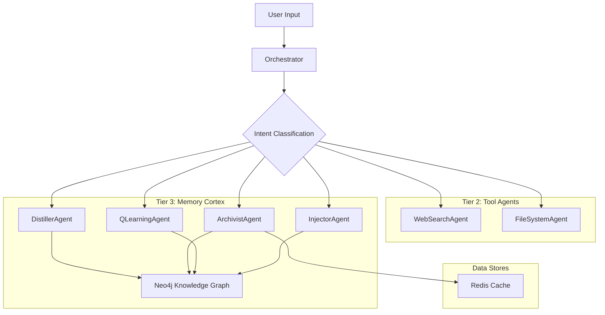

# External Context Engine (ECE) - Project Overview

## Project Description
The External Context Engine (ECE) is a sophisticated cognitive architecture designed to provide persistent memory and context management for AI systems. It's an advanced agentic system that enables AI applications to maintain long-term relationships, recall past conversations, and build coherent narratives from fragmented knowledge. The system is designed to operate entirely on local hardware without cloud dependencies.

## 📋 Project Overview

The External Context Engine (ECE) is a sophisticated cognitive architecture designed to provide persistent memory and context management for AI systems. This repository contains the implementation of the ECE, which focuses on creating an intelligent memory management system with Q-Learning powered context retrieval.

## 🎯 Key Features

### Intelligent Memory Management
- **Archivist Agent**: Central coordinator for knowledge graph operations
- **QLearning Agent**: Reinforcement learning for optimal path finding
- **Context Cache**: Redis-based caching.
- **Token-Aware Summarization**: Processes large amounts of context.

### Enhanced Context Retrieval
- **Keyword-Based Querying**: Extracts keywords for targeted memory retrieval
- **Semantic Search**: Vector similarity search using Sentence Transformers
- **Path Finding**: Q-Learning optimized traversal of knowledge graph
- **Context Summarization**: Token-aware summarization within LLM limits

### Local-First and Performant
- **Local Execution**: Runs entirely on local hardware without cloud dependencies.
- **Script-based**: Uses simple scripts for launching and managing agents.
- **Memory Management**: Includes a configurable memory limiter for Windows to prevent crashes.
- **GPU Acceleration**: Supports CUDA for accelerated embedding generation.

## Architecture Overview
The ECE implements a multi-tier agent architecture:

- **Tier 1**: Orchestrator Agent - Central coordinator that routes prompts to appropriate agents
- **Tier 2**: Tool Agents - Specialized agents like WebSearchAgent and FileSystemAgent
- **Tier 3**: Memory Cortex - Core memory management agents including:
  - ArchivistAgent: Central coordinator for knowledge graph operations
  - QLearningAgent: Reinforcement learning for optimal path finding in the knowledge graph
  - DistillerAgent: Processes raw text to extract structured information
  - InjectorAgent: Optimizes the knowledge graph through reinforcement learning

### Core Technologies
- **LLM Integration**: Supports multiple providers (Ollama, llama.cpp, Docker Desktop)
- **Knowledge Graph**: Neo4j for persistent memory storage
- **Caching**: Redis-based context cache with 32GB allocation
- **Framework**: FastAPI for web services
- **Communication**: UTCP (Universal Tool Calling Protocol) for tool discovery and execution

## Key Features

### Markovian Thinking Architecture
The ECE implements a sophisticated reasoning system called "Markovian Thinking":
- **Chunked Reasoning**: Processes information in fixed-size context windows
- **Dual-LLM PEVG Model**: Uses a Primary LLM (Generator) and TRM Service (Executor/Verifier)
- **Iterative Refinement**: Implements "propose -> critique -> refine" loops via specialized TRM service
- **Textual Carryover**: Maintains context between chunks with concise summaries

### Multi-Agent Coordination & Emergence
Based on research findings from "Emergent Coordination in Multi-Agent Language Models", the ECE implements enhanced coordination between agents:
- **Thinker Personas**: Each thinker agent is assigned a detailed persona with background, expertise, and personality traits to create stable identity-linked differentiation.
- **Theory of Mind (ToM) Integration**: Thinker agents are instructed to consider what other agents might do and how their actions might affect the group outcome, enabling more effective collaboration.
- **Role Complementarity**: Different thinkers are assigned complementary roles (Optimist, Pessimist, Analytical, Creative, Pragmatic, Strategic, Ethical) to ensure diverse perspectives contribute to the solution.
- **Coordination Analysis**: The system includes metrics to measure synergy, diversity, and complementarity among thinker agents to ensure productive collective intelligence.
- **Emergent Behavior Steering**: Prompt design and role assignments are used to steer the system from mere aggregates to higher-order collectives with coordinated behavior.

### Performance Optimization
- **C++/Cython Integration**: Performance-critical components rewritten in C++
- **Profiling-Driven Development**: Regular performance profiling with cProfile and snakeviz
- **GPU Acceleration**: CUDA support for accelerated embedding generation

### Core Capabilities
- **Intelligent Memory Management**: Q-Learning powered context retrieval
- **Context-Aware Prompt Management**: Dynamic adjustment of content based on model capabilities
- **Token-Aware Summarization**: Processes large contexts up to 1M tokens
- **Local-First Architecture**: Runs entirely on local hardware without cloud dependencies

## 🏗️ Architecture

The ECE is a multi-agent system composed of smaller, specialized, and independently deployable components.



## Building and Running

### Prerequisites
- Python 3.11+
- Neo4j database
- Redis server
- CUDA-compatible GPU (for GPU acceleration)

### Setup
1. Install dependencies: `pip install -r requirements.txt`
2. Configure environment: Create `.env` file with Neo4j and Redis connection details
3. Configure LLM provider in `config.yaml`:
   ```yaml
   llm:
     active_provider: llama_cpp  # or ollama
     providers:
       llama_cpp:
         model_path: "./models/your-model.gguf"
         api_base: "http://localhost:8080/v1"
     ```

### Running the System
1. Start required services (Neo4j, Redis)
2. If using llama.cpp, run it first:
   - Use `run_llama_server.bat` (Windows) or appropriate script
3. Start all ECE agents:
   ```
   python run_all_agents.py
   ```
   This starts all agents on different ports (8000-8007)

### Service Setup

The ECE requires several external services to operate correctly. We've provided scripts to help with setup:

#### Automated Setup (Recommended)

1. Run the installation script to prepare your environment:
   ```bash
   python install_services.py
   ```

2. Install required services manually using the provided scripts:
   - Redis: `install_redis.bat`
   - Neo4j: `install_neo4j.bat`
   - UTCP components: Follow instructions in SETUP_INSTRUCTIONS.txt

3. Use the service launcher to start all required services:
   ```bash
   start_ece_services.bat
   ```

#### Manual Setup

If you prefer manual setup, follow these steps:

1. **Install Redis**:
   - For Windows: `choco install redis-64 -y` (requires Chocolatey)
   - Or download from https://github.com/tporadowski/redis/releases
   - Start Redis server

2. **Install Neo4j**:
   - Download from https://neo4j.com/download-center/
   - Install Neo4j Desktop or Server
   - Set up a local DBMS with a password (default: 'password')
   - Start the database

3. **Install UTCP components**:
   - Install the UTCP client with: `pip install utcp`
   - Each ECE agent serves its own UTCP manual at the `/utcp` endpoint following the official UTCP 1.0+ specification
   - No central registry is required - services are discovered via their individual endpoints

4. **Verify all services** are running:
   ```bash
   python bootstrap.py
   ```

### UTCP Implementation

The ECE now fully implements the Universal Tool Calling Protocol (UTCP) 1.0+ specification using a decentralized architecture:

- Each service serves its own UTCP Manual at the standard `/utcp` endpoint
- No central registry service is required
- Tools are discovered by fetching UTCP manuals directly from service endpoints
- Each tool is identified with a namespaced identifier (e.g., `filesystem.read_file`)
- The forge-cli can discover and use tools from all running ECE agents

This decentralized approach provides better reliability, scalability, and aligns with the official UTCP specification.

### Core Logic and Stability Enhancements
The ECE now includes robust prompt management to prevent context overflow issues:

1. **Context-Aware Prompt Management**: The system includes a context-aware prompt manager that dynamically adjusts content based on model capabilities and context window limits.

2. **Intelligent Truncation**: Uses token counting and content preservation techniques to maintain critical information when prompts are truncated.

3. **Fallback Strategies**: Implements graceful fallback approaches (summarization, chunking) when context limits are reached.

4. **Monitoring**: Comprehensive metrics and monitoring for prompt sizes and context usage across the system.

To run the stability tests:
```bash
python -m pytest Tests/test_prompt_management.py
python -m pytest Tests/test_prompt_management_integration.py
```

### Packaging and Distribution
The ECE can be packaged into a single executable for easy distribution:

1. **Prerequisites**: Install PyInstaller with `pip install pyinstaller`

2. **Build the Package**: Run the appropriate build script for your platform:
   - On Windows: `build_package.bat`
   - On Linux/macOS: `chmod +x build_package.sh && ./build_package.sh`

3. **Bootstrapping**: The packaged application includes a bootstrapping mechanism that checks for required services before starting agents.

4. **Run the Packaged Application**: After building, you can run the packaged application with the generated executable.

### Markovian Thinking Implementation
The ECE now includes Markovian thinking capabilities for deep reasoning:

1. **TRM Service Client**: The system includes a client for communicating with specialized Tokenized Reasoning Model (TRM) services for iterative refinement.

2. **Markovian Reasoning Loop**: Implementation of the chunked reasoning process with textual carryover between iterations.

3. **Intelligent Routing**: The Orchestrator automatically determines when to use Markovian thinking based on query complexity.

4. **Dual-LLM PEVG Model**: The system leverages both a Primary LLM for final responses and a specialized TRM service for the iterative reasoning process.

To run the Markovian thinking tests:
```bash
python -m pytest Tests/test_markovian_thinking.py
```

### Performance Profiling and Optimization
To profile the ECE application for performance bottlenecks:
```bash
python profile_ece.py
python profile_qlearning.py
python profile_distiller.py
```

To build the optimized C++ extensions with Cython:
```bash
python setup.py build_ext --inplace
```

Or use the batch script:
```
build_extensions.bat
```

### Usage
```bash
# Send a context-aware prompt
curl -X POST http://localhost:8000/chat \
  -H "Content-Type: application/json" \
  -d '{"prompt": "What did we discuss about memory management?"}'

# Store new context
curl -X POST http://localhost:8000/memory/store \
  -H "Content-Type: application/json" \
  -d '{"raw_text": "Memory management is crucial for AI systems with large context windows."}'

# Query memory
curl -X POST http://localhost:8000/memory/query \
  -H "Content-Type: application/json" \
  -d '{"query": "memory management", "max_tokens": 1000000}'
```

## 🧠 Core Agents

- **Orchestrator**: The central nervous system. Classifies intent and delegates tasks to other agents.
- **DistillerAgent**: Analyzes raw text to extract entities and relationships.
- **ArchivistAgent**: Persists structured data to the Neo4j knowledge graph.
- **QLearningAgent**: Intelligently traverses the knowledge graph to find optimal context paths.
- **InjectorAgent**: Optimizes the knowledge graph through reinforcement learning.
- **FileSystemAgent**: Provides tools for reading, writing, and listing files.
- **WebSearchAgent**: Provides tools for internet-based searches.

## Development

### Setting Up Development Environment
```bash
# Create virtual environment
python -m venv .venv
# Activate the virtual environment
# On Windows: .venv\Scripts\activate
# On macOS/Linux: source .venv/bin/activate

# Install dependencies
pip install -r requirements.txt
```

### Running Tests
```bash
pytest tests/
```

### Code Quality
```bash
# Project Vision: The Ark

The primary goal of the ECE project is the creation of "The Ark," a sovereign, local-first AI that functions as the Architect's **Externalized Executive Function**. It must be private, efficient, and powerful, operating entirely on local hardware without reliance on cloud services.

## Architectural Philosophy

The ECE architecture represents a deliberate move **away from brittle, monolithic AI systems**. The core philosophy is to build a robust, self-correcting, and intelligent **multi-agent system** composed of smaller, specialized, and independently deployable components.

## LLM Configuration

The ECE supports multiple LLM providers with a flexible configuration system. The configuration is managed through the `config.yaml` file:

```yaml
llm:
  active_provider: ollama  # Can be ollama, docker_desktop, or llama_cpp
  providers:
    ollama:
      model: "granite3.1-moe:3b-instruct-q8_0"
      api_base: "http://localhost:11434/v1"
    docker_desktop:
      model: "ai/mistral:latest"
      api_base: "http://localhost:12434/v1"
    llama_cpp:
      model_path: "/path/to/your/model.gguf"
      api_base: "http://localhost:8080/v1"
```

### Supported Providers

- **Ollama**: Default provider using local Ollama instance
- **Docker Desktop**: OpenAI-compatible endpoint for Docker-based models
- **Llama.cpp**: High-performance local inference with GGUF models

To switch providers, simply change the `active_provider` value in the configuration file.

### Setting up llama.cpp on Windows

To use the llama.cpp provider, build the llama.cpp project on Windows:

1. **Prerequisites**:
   - Git for Windows
   - CMake
   - Visual Studio Community with "Desktop development with C++" workload
   - (Optional) NVIDIA CUDA Toolkit for GPU acceleration

2. **Build Steps**:
   - Clone the repository: `git clone https://github.com/ggerganov/llama.cpp`
   - Create build directory: `mkdir build && cd build`
   - Configure CMake: `cmake .. -G "Visual Studio 17 2022"` (for CPU) or `cmake .. -G "Visual Studio 17 2022" -DLLAMA_CUBLAS=ON` (for CUDA)
   - Build: `cmake --build . --config Release`

3. **Running the Server**:
   - Start with: `server.exe -m path\to\model.gguf -c 4096`
   - Update config.yaml to point to the correct model path and server endpoint

## Core Technical Strategy

The system is designed to achieve state-of-the-art reasoning capabilities on local hardware by implementing principles from cutting-edge research.

### Cognitive Model: Markovian Thinking

Inspired by the "Markovian Thinker" and "Delethink" research, the ECE's core reasoning process is **not based on an ever-growing context window**. Instead, it operates on a **Markovian principle**, where reasoning is broken down into a sequence of fixed-size "chunks."

-   **Chunked Reasoning:** An agent processes information in a small, fixed-size context window (e.g., 4k or 8k tokens).
-   **Context Reset:** After each chunk is processed, the context is reset.
-   **Textual State (Carryover):** The model is trained to generate a concise **textual summary** of its reasoning at the end of each chunk. This "carryover" is the *only* information passed to the next chunk, acting as the complete state of the reasoning process.

This approach decouples thinking length from context size, enabling **linear compute time and constant memory usage**, which is essential for achieving deep reasoning on local hardware.

### Context Management: Prompt Truncation and Overflow Prevention

To address the critical `context overflow` issue, the ECE implements a robust prompt management system:

-   **Context-Aware Prompt Management:** The system includes a context-aware prompt manager that dynamically adjusts content based on model capabilities and context window limits.
-   **Intelligent Truncation:** Uses token counting and content preservation techniques to maintain critical information when prompts are truncated.
-   **Fallback Strategies:** Implements graceful fallback approaches (summarization, chunking) when context limits are reached.
-   **Monitoring:** Comprehensive metrics and monitoring for prompt sizes and context usage across the system.

### Agentic Framework: The Dual-LLM PEVG Model

Our **Planner, Executor, Verifier, Generator (PEVG)** framework is powered by a dual-LLM strategy that leverages Markovian Thinking:

-   **Primary LLM (The Generator):** A powerful, general-purpose model (e.g., Phi-3) responsible for generating the final, high-quality, user-facing responses. It operates on a standard, larger context window.
-   **TRM Service (The Markovian Thinker):** A small, hyper-specialized, and extremely fast model (e.g., a fine-tuned `AI21-Jamba-Reasoning-3B`) that powers the iterative, self-corrective reasoning loop. This is our Executor and Verifier.
-   **EnhancedOrchestratorAgent**: The current implementation uses EnhancedOrchestratorAgent which implements context-aware prompt management, parallel thinking with specialized thinkers, and synthesis of responses. It includes a `process_prompt_with_context_management` method that handles prompt processing with context retrieval from the Archivist, parallel thinking with multiple specialized thinkers, and synthesis of responses.

### Markovian Thinking Architecture

To enable deep reasoning on local hardware, the ECE implements a sophisticated Markovian Thinking architecture based on the research paper "The Markovian Thinker":

-   **TRM Client Integration:** The system includes a TRM_Client class to communicate with specialized Tokenized Reasoning Model services.
-   **Iterative Refinement:** Implements a "propose -> critique -> refine" loop for improving thought processes.
-   **Chunked Reasoning:** Breaks complex problems into fixed-size chunks with textual carryover to maintain context, allowing extremely long reasoning while using bounded memory.
-   **Intelligent Routing**: Determines when to use Markovian thinking based on query complexity and length using the ReasoningAnalyzer.
-   **Carryover Management**: Maintains consistency between reasoning iterations through textual state carryover.
-   **Delethink Environment**: Implements the Delethink RL environment concept where reasoning proceeds in fixed-size chunks, and at each boundary the environment resets the context and reinitializes the prompt with a short carryover from the previous chunk.
-   **Linear Compute Scaling**: Enables linear compute with constant memory with respect to thinking length, decoupling "how long the model thinks" from "how much context it must process."
-   **Fallback Mechanisms**: Includes robust fallback to parallel thinking when Markovian reasoning encounters issues.

### Coordination in Multi-Agent Systems

Based on research findings from "Emergent Coordination in Multi-Agent Language Models", the ECE implements enhanced coordination between agents:

-   **Thinker Personas**: Each thinker agent is assigned a detailed persona with background, expertise, and personality traits to create stable identity-linked differentiation.
-   **Theory of Mind (ToM) Integration**: Thinker agents are instructed to consider what other agents might do and how their actions might affect the group outcome, enabling more effective collaboration.
-   **Role Complementarity**: Different thinkers are assigned complementary roles (Optimist, Pessimist, Analytical, Creative, Pragmatic, Strategic, Ethical) to ensure diverse perspectives contribute to the solution.
-   **Coordination Analysis**: The system includes metrics to measure synergy, diversity, and complementarity among thinker agents to ensure productive collective intelligence.
-   **Emergent Behavior Steering**: Prompt design and role assignments are used to steer the system from mere aggregates to higher-order collectives with coordinated behavior.

### Performance Optimization: Python, Cython, and C++

To achieve the required performance, the ECE will adopt a hybrid development model:
-   **Python**: Used for high-level orchestration and non-performance-critical logic.
-   **C++/Cython**: Performance-critical components, identified through profiling with tools like `cProfile` and `snakeviz`, will be rewritten in C++ and bridged to Python using Cython.
-   **Profiling-Driven Development**: Regular performance profiling will be integrated into the development process to continuously identify and address bottlenecks as the system evolves.

## System Components & Deployment

-   **OrchestratorAgent**: The central Planner, delegating tasks via UTCP.
-   **Tool Agents**: `FileSystemAgent`, `WebSearchAgent`.
-   **Memory Cortex**: `Distiller`, `Archivist`, `QLearning`, and `Injector` agents.
-   **Local-First Deployment**: The system is built to run on local scripts, with a future goal of being packaged into a single executable using **PyInstaller**.
-   **Packaging Strategy**: The system will be packaged into a distributable executable with embedded configuration files and a bootstrapping mechanism to check for required services (Neo4j, Redis) before starting agents.

## Validation, Refinement, and Evolution Strategy

With the core architecture complete, the ECE transitions from implementation to validation, refinement, and continuous evolution:

### System Validation & GUI Testing (Phase 6)
The system undergoes rigorous end-to-end testing, focusing on real-world usage scenarios to ensure all components work together seamlessly.

### TRM Specialization (Phase 7)
The mock TRM service will be replaced with fine-tuned specialized models trained on custom datasets for improved reasoning capabilities.

### Continuous Improvement (Phase 8)
The system enters a continuous evolution phase with:
- Active performance monitoring and optimization
- Expansion of specialized TRM models for different tasks
- Continuous curation and expansion of the knowledge graph
- Enhanced self-modification capabilities

## Co-Evolutionary Mandate

The system must be capable of understanding and modifying its own codebase, a goal directly supported by the deep reasoning capabilities enabled by Markovian Thinking.

## Current Development Phases
The project has completed major architectural implementation phases and is now focused on:

1. **Phase 6**: System Validation & GUI Testing - End-to-end testing of workflows
2. **Phase 7**: TRM Fine-Tuning & Specialization - Replacing mock TRM with fine-tuned models
3. **Phase 8**: Continuous Improvement & Co-Evolution - Ongoing system enhancement

## Configuration
The system uses multiple configuration files:
- `config.yaml`: Main system configuration including LLM providers and memory limits
- `.env`: Environment-specific settings like API keys and service URLs
- Individual agent configuration files for specific behaviors

## Key Files
- `run_all_agents.py`: Main entry point to start all ECE agents
- `config.yaml`: Main configuration file for the system
- `requirements.txt`: Python dependencies
- `specs/`: Directory containing architectural specifications and plans
- Various agent files in `ece/agents/` directories

## Recent Enhancements

### Coordination Analyzer Module
- Created `coordination_analyzer.py` with classes to measure synergy, diversity, and complementarity among thinker agents
- Implemented `CoordinationAnalyzer` with metrics based on information theory concepts from the research
- Created `ThinkerCoordinator` to manage persona assignments and Theory of Mind (ToM) instructions

### Enhanced Thinker Architecture
- Updated `BaseThinker` class to include persona assignments and ToM capabilities
- Modified the `think` method to accept information about other thinkers and incorporate ToM considerations
- Updated `SynthesisThinker` to be compatible with the new architecture

### Coordinated Parallel Thinking
- Enhanced the `parallel_thinking` method to use coordination-aware thinking
- Added collection of thinker roles and descriptions for ToM instructions
- Implemented coordination metrics analysis during the parallel thinking process

### Configuration Updates
- Updated `config.yaml` with detailed persona definitions for each thinker type
- Added role descriptions and system prompts that align with the research findings

### Spec Documentation Updates
- **spec.md**: Added section 3.6 on "Coordination in Multi-Agent Systems" detailing the implementation
- **reasoning_flow.md**: Added section on "Multi-Agent Coordination & Emergence" explaining the coordination approach
- **tasks.md**: Added T-015 for "Multi-Agent Coordination Implementation" with detailed tasks
- **plan.md**: Added Phase 20 for "Multi-Agent Coordination & Emergence" with implementation goals
- **specs/README.md**: Updated to reflect the new multi-agent coordination implementation
# Run linting
# (linter to be configured)

# Run type checking
# (type checker to be configured)

# Format code
# (formatter to be configured)
```

## 🤝 Contributing

We welcome contributions to the ECE project! Please see our `CONTRIBUTING.md` for details on how to get involved.

## 📄 License

This project is licensed under the MIT License - see the `LICENSE` file for details.