# Anchor Core Architecture Specification (v2.3.4)

**Status:** Active (Text-Only + Watchdog + Context Persistence + Enhanced Resurrection) | **Component:** `tools/webgpu_bridge.py`

## Overview
The Anchor Core unifies the Bridge, UI, and API into a single process running on port 8000, eliminating CORS issues and port conflicts. The system now uses an online-only model loading approach for reliable operation, with local model resolution as a fallback. Includes Watchdog service for passive text ingestion and enhanced auto-resurrection for browser process management.

## Architecture Diagram

```mermaid
graph TD
    User["👤 User"] --> Dashboard["🏠 Dashboard (index.html)"]

    subgraph "ANCHOR CORE (Single Process)"
        Bridge["🔗 WebGPU Bridge (8000)"]
        API["⚡ API Endpoints"]
        UI["🌐 UI Server"]
        WS["📡 WebSocket Layer"]
        ModelRedirect["🔄 Model Redirect"]
        Resurrection["🔄 Auto-Resurrection"]
    end

    subgraph "PASSIVE INGESTION"
        Watchdog["🐕 Watchdog Service"]
        ContextFolder["📁 context/ folder"]
        FileEvents["📝 File System Events"]
    end

    Dashboard --> Bridge
    Bridge --> API
    Bridge --> UI
    Bridge --> WS
    Bridge --> ModelRedirect
    Bridge --> Resurrection

    subgraph "SHELL PROTOCOL"
        API --> ShellExec["쉘 /v1/shell/exec"]
        API --> Spawn["🚀 /v1/system/spawn_shell"]
    end

    subgraph "MEMORY INGESTION"
        API --> IngestAPI["📥 /v1/memory/ingest"]
        Watchdog --> IngestAPI
        ContextFolder --> Watchdog
        FileEvents --> Watchdog
    end

    ShellExec --> Host["🖥️ Host System"]
    Spawn --> PowerShell["🪟 PowerShell Window"]

    subgraph "MODEL LOADING"
        ModelRedirect --> Local["💾 Local Models (if available)"]
        ModelRedirect --> Online["🌐 Online Models (fallback)"]
    end
```

## Components

### 1. The Unified Core (`webgpu_bridge.py`)
- **Role:** Single server for API, UI, and WebSockets
- **Port:** 8000 (The One Port)
- **Function:** Bridges browser WebGPU to system commands

### 2. Shell Protocol (The Hands)
- **`/v1/shell/exec`**: Execute system commands via bridge

### 3. Context System
- **Context UI**: Read-only interface for quick context retrieval and copy-paste.
- **Memory Search**: Query the Ghost Engine's Graph (Vector + BM25) for relevant context.

### 4. Model Loading System
- **Online-First**: Uses direct HuggingFace URLs for reliable loading (Standard 007)
- **Local Fallback**: Redirects to local models when available, online when not
- **Bridge Redirect**: `/models/{model}/resolve/main/{file}` endpoint handles resolution

### 5. Passive Ingestion System
- **Watchdog Service**: Monitors `context/` folder for text file changes
- **Debounce & Hash Check**: Prevents duplicate ingestion from autosave events
- **File Ingestion Endpoint**: `/v1/memory/ingest` for text content ingestion
- **Automatic Processing**: Processes .txt, .md, .markdown, .py, .js, .html, .json, .yaml, .yml, .sh, .bat and other code/text files automatically
- **Code File Support**: Expanded to include common programming language extensions
- **Session Recording**: Daily chat session files created in `context/sessions/` for persistence

### 6. Session Recording System
- **Daily Files**: Creates `chat_YYYY-MM-DD.md` files for each day's conversations
- **Text-File Source of Truth**: All chat history saved to markdown files for cross-machine sync
- **Timestamped Entries**: Messages formatted with timestamps (`### ROLE [HH:MM:SS]`)
- **Infinite Loop**: Chat -> File -> Ingestion -> Memory -> Next Chat
- **Cross-Machine Sync**: Files automatically synced via Dropbox/Git for multi-device access

### 7. Process Management System
- **Auto-Resurrection**: Automatically restarts Ghost Engine when connection drops
- **Process Cleanup**: Kills existing browser processes before launching new ones
- **Port Management**: Explicitly manages remote debugging port (9222) to prevent conflicts
- **Retry Logic**: Implements retry mechanism with configurable attempts

## Endpoints

### `GET /sidecar`
- **Function:** Serves the Context UI (consolidated interface).

### `GET /context`
- **Function:** Serves the Context UI (consolidated interface).

### `POST /v1/memory/search`
- **Function:** Queries the Ghost Engine's Graph (Vector + BM25).
- **Input:** `{ "query": "string" }`
- **Output:** `{ "context": "Formatted Ground Truth..." }`

### `POST /v1/chat/completions`
- **Function:** Proxy to browser engine
- **Auth:** Bearer token

### `POST /v1/shell/exec`
- **Function:** Execute system commands
- **Format:** `{ "cmd": "command" }`

### `POST /v1/system/spawn_shell`
- **Function:** Launch native PowerShell client
- **Result:** New `anchor.py` terminal window

### `POST /v1/memory/ingest`
- **Function:** Ingest text content into memory graph
- **Format:** `{ "content": "text", "source": "file_path", "timestamp": "ISO" }`
- **Response:** `{ "status": "success", "message": "Memory ingested successfully" }`

### `POST /v1/gpu/lock`
- **Function:** Acquire GPU resource with queuing
- **Response:** `{ "status": "acquired", "token": "gpu_token_..." }`

### `POST /v1/gpu/unlock`
- **Function:** Release GPU resource
- **Response:** `{ "status": "released" }`

### `GET /v1/gpu/status`
- **Function:** Get GPU lock status and queue depth
- **Response:** `{ "locked": true/false, "owner": "agent_id", "queue_depth": number }`

## Search Architecture

### Hybrid Retrieval System

* **BM25 FTS**: Lexical search using CozoDB Full Text Search with stemming
* **Context Manager**: Intelligent retrieval in `ContextManager.findRelevantMemories()`
* **Fallback Mechanism**: Regex-based search when FTS index unavailable

## Security
- **Token Auth:** `Authorization: Bearer sovereign-secret`
- **CORS Policy:** Open for internal use only
- **System Access:** Restricted to authorized commands