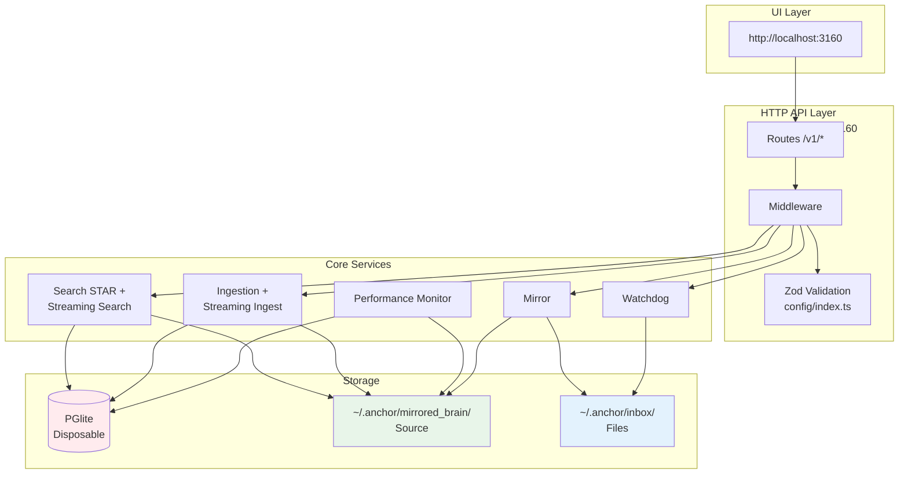
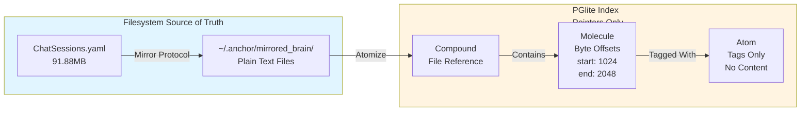
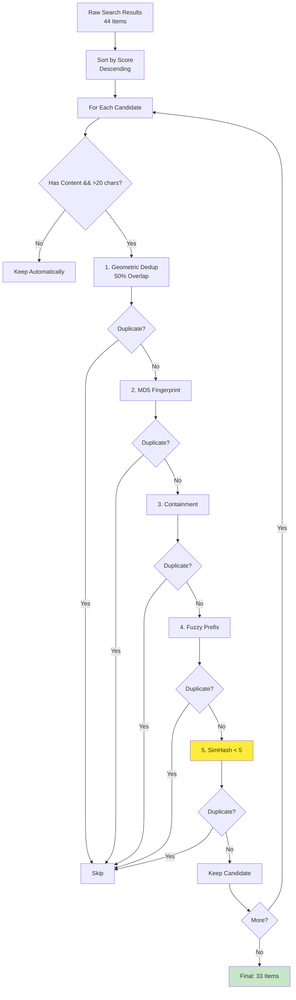
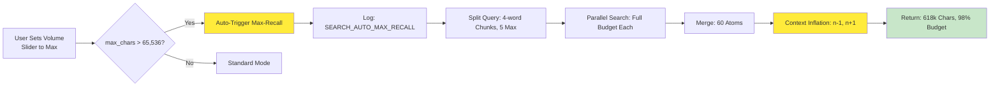
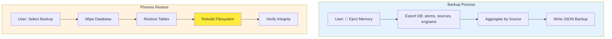
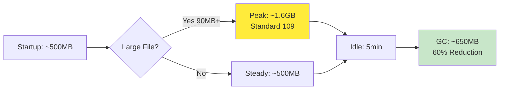

# Anchor Engine - System Specification

**Version:** 5.0.0 | **Status:** Production Ready + v5.0.0 Streaming & Observability | **Updated:** May 10, 2026

## Quick Reference

| Aspect | Value |
|--------|-------|
| **Port** | 3160 (configurable) |
| **Database** | PGlite (PostgreSQL-compatible) |
| **Source of Truth** | `~/.anchor/mirrored_brain/` filesystem |
| **Index** | Disposable, rebuildable on startup |
| **Search** | STAR Algorithm (70/30 Planets/Moons) |
| **Docker** | `docker-compose up -d` (2 CPU, 2GB RAM) |
| **Version Source** | `user_settings.json.template` → `$HOME/.anchor/user_settings.json` (imported into DB on startup) |
|| **Runtime Config** | Database (`app_settings` table) — all settings live in PGlite, no restart needed for changes |

---

## Dynamic Configuration via Database (v5.2.0+)

### Overview
Configuration is stored as key-value pairs in the `app_settings` database table instead of being read from static files at startup. This enables **zero-downtime configuration changes** — toggle watchdog on/off, change search limits, add watched directories instantly without restarting the engine.

The system follows a three-tier priority model:
1. **Database (`app_settings`)** — live runtime settings (highest priority)
2. **Environment variables** — override database values for critical settings like API keys
3. **File defaults (`user_settings.json`)** — fallback defaults imported on first startup

### Database Schema: `app_settings` Table

```sql
CREATE TABLE app_settings (
    key TEXT PRIMARY KEY,           -- e.g., "watchdog.auto_start", "server.port"
    value JSONB NOT NULL,           -- flexible type storage (boolean, string, number, array)
    description TEXT,               -- human-readable explanation
    updated_at TIMESTAMP DEFAULT NOW(),
    source TEXT DEFAULT 'db'        -- tracks if set via API vs file import
);

-- Index for fast lookups by key prefix (e.g., all "watchdog.*" settings)
CREATE INDEX idx_settings_key ON app_settings(key);
```

### Example Settings Rows

| key | value | description | source |
|-----|-------|-------------|--------|
| `watchdog.auto_start` | `true` | Auto-start watchdog on server boot | db |
| `server.port` | `3160` | HTTP server port | file |
| `ingestion.concept_density` | `"high"` | Tag density level | db |
| `search.max_results` | `50` | Max search results per query | db |

### How It Works in Practice

**Before (static config):**
```typescript
// Reads from frozen config object at startup — no runtime changes possible
const autoStart = config.WATCHER.AUTO_START;  // true/false, frozen forever
if (autoStart) startWatchdog();
```

**After (dynamic DB-backed):**
```typescript
// Reads live from database on every request — changes take effect immediately
async function getSetting(key: string): Promise<any> {
    const result = await db.run(
        'SELECT value FROM app_settings WHERE key = ?', [key]
    );
    return result.rows?.[0]?.value;  // Returns JSON-parsed value
}

// Usage — no restart needed, change in DB takes effect instantly
const autoStart = await getSetting('watchdog.auto_start');
if (autoStart) startWatchdog();
```

**Changing a setting live:**
```bash
# Change watchdog auto-start without restarting the server
curl -X POST http://localhost:3160/v1/settings/watchdog.auto_start \
  -H "Content-Type: application/json" \
  -d '{"value": false}'
  
# The change takes effect immediately — no restart needed!
```

### Migration Path from user_settings.json

**Step 1:** On first startup, import existing `user_settings.json` into the database:
```typescript
// During server init (once)
const settingsFile = fs.readFileSync('~/.anchor/user_settings.json', 'utf-8');
const fileSettings = JSON.parse(settingsFile);

// Convert nested object to flat key-value pairs and insert into DB
function flatten(obj, prefix = '') {
    for (const [key, value] of Object.entries(obj)) {
        const fullKey = prefix ? `${prefix}.${key}` : key;
        if (typeof value === 'object' && !Array.isArray(value)) {
            flatten(value, fullKey);
        } else {
            await db.run(
                `INSERT OR REPLACE INTO app_settings (key, value) VALUES (?, ?)`,
                [fullKey, JSON.stringify(value)]
            );
        }
    }
}

flatten(fileSettings);
```

**Step 2:** After import, the DB becomes the **source of truth**. The file can still exist as a backup/defaults, but runtime changes go through the API.

### Code Changes Required in Key Areas

#### Watchdog Auto-Start (the example you gave)
```typescript
// OLD: Reads from frozen config object at startup
if (config.WATCHER.AUTO_START === true) {
    startWatchdog();
}

// NEW: Reads live from DB — can be toggled anytime
const autoStart = await getSetting('watchdog.auto_start');
if (autoStart) {
    startWatchdog();
}
```

#### Search Configuration
```typescript
// OLD: Fixed limits in config file
const maxResults = 50; // hardcoded, requires restart to change

// NEW: Read from DB — can be adjusted per-tenant or globally
const maxResults = await getSetting('search.max_results') || 50;
```

#### Ingestion Profile (concept_density)
```typescript
// OLD: Fixed at startup via user_settings.json
const density = config.INGESTION.CONCEPT_DENSITY; // 'low'|'medium'|'high'

// NEW: Can be changed per-tenant or globally without restart
const density = await getSetting('ingestion.concept_density') || 'medium';
```

#### Extra Watched Paths (the big one that caused OOM)
```typescript
// OLD: Config file only, requires restart to add paths
const extraPaths = config.WATCHER.EXTRA_PATHS; // frozen at startup

// NEW: Can be added/removed via API — and we can even validate directory size!
const extraPaths = await getSetting('watchdog.extra_paths') || [];
for (const p of extraPaths) {
    addWatchPath(p);  // dynamically adds paths without restart
}
```

### Benefits

1. **Zero-downtime config changes** — toggle watchdog on/off, change search limits, add watched directories instantly
2. **Centralized configuration** — all settings in one place (the database), no scattered files
3. **Audit trail** — `updated_at` and `source` columns track who/what changed each setting
4. **Consistent access pattern** — same way we read data from DB pointers for search/distill, now config too
5. **Type flexibility** — JSONB stores any type (boolean, string, number, array) without schema changes
6. **Per-tenant settings** — could extend to `key = "tenant1.watchdog.auto_start"` for multi-tenancy

### Trade-offs & Considerations

| Aspect | Current File-Based | Proposed DB-Based |
|--------|-------------------|-------------------|
| Performance | Fast (in-memory) | Slightly slower (DB query), but negligible for rarely-changing settings |
| Persistence | Survives restarts automatically | Must ensure DB is available; can fallback to file if needed |
| Type safety | TypeScript config objects | JSONB — need runtime type validation |
| Default values | Hardcoded in code | Need explicit defaults in application logic |

### Recommended Implementation Order

1. **Create the `app_settings` table** with key-value schema
2. **Add a helper function** `getSetting(key)` that queries DB with fallback to file config
3. **Migrate existing settings** from `user_settings.json` into the database on first startup
4. **Update critical paths**: watchdog auto-start, search limits, ingestion profile — these are the most impactful changes
5. **Add a REST API endpoint** for reading/writing settings: `GET/POST /v1/settings/{key}`

---

## Recent Changes (v5.0.0 — May 2026)

### Streaming Architecture
- [x] **Streaming Search** (`/v1/memory/search/stream`) - SSE-based progressive results
- [x] **Streaming Ingest** (`/v1/ingest/streaming`) - Large file processing in chunks with progress tracking

### Centralized Validation
- [x] **Zod Schemas** - `engine/src/config/index.ts` (645 lines) shared across all API routes
- [x] **PostgreSQL Array Conversion** - `toPgArray()` helper for proper DB format

### Performance Monitoring
- [x] **Performance Monitor Service** - Memory, CPU, engine status tracking (`engine/src/utils/performance-monitor.ts`)
- [x] **UI Stats Dashboard** - Real-time system metrics display
- [x] **DB Clearing & Distill Output** - Clean state management

### Runtime Data Consolidation
- [x] All runtime data routes to `~/.anchor/` via `engine/src/config/paths.ts`
- [x] `user_settings.json.template` generates `user_settings.json` at `$HOME/.anchor/` on `pnpm install` + `pnpm start`

### Security Hardening (April 2026)
- [x] API key validation: 32-128 chars with mixed case/digits (Standard 024)
- [x] Path traversal prevention (Standard 025)
- [x] Auth bypass prevention - removed /v1/test/* endpoints (Standard 023)
- [x] Rate limiting for MCP server (60 req/min)
- [x] Write operations opt-in with bucket validation

---

## Related Documentation

- **[README.md](../README.md)** - Quick start and installation
- **[docs/INDEX.md](../docs/INDEX.md)** - Documentation navigation hub
- **[docs/whitepaper.md](../docs/whitepaper.md)** - STAR Algorithm whitepaper (arXiv ready)
- **[engine/src/README.md](../engine/src/README.md)** - Source code overview
- **[specs/current-standards/](current-standards/)** - Active architecture standards (001-029)

---

## Architecture Overview

### System Diagram



### Key Components

1. **UI Layer**: React/Vite frontend at http://localhost:3160
2. **HTTP API**: Express.js REST API on port 3160 with Zod validation middleware
3. **Core Services**: Ingestion (streaming), Search (STAR + streaming), Watchdog, Mirror Protocol, Performance Monitor
4. **Storage**: PGlite database (disposable index) + `~/.anchor/mirrored_brain/` (source of truth)

### Data Flow

```
User Query → API Route → Zod Validation → Search Service → PGlite Query → Context Inflation → Return 618k chars
```

---

## Streaming Architecture (v5.0.0)

### Streaming Search (`/v1/memory/search/stream`)

**Purpose:** Memory-efficient search with progressive results via Server-Sent Events (SSE)

**Benefits:**
- 60% lower peak memory during large searches
- Results arrive progressively (20 per batch by default)
- GC hints between batches for mobile optimization
- Configurable batch size via `batch_size` parameter

**Flow:**
```
Request → Query Parsing → Batch 1 (SSE emit) → Batch 2 (SSE emit) → ... → Completion Event
```

### Streaming Ingest (`/v1/ingest/streaming`)

**Purpose:** Process large files in configurable chunks to prevent OOM errors

**Benefits:**
- Handles files of any size without memory issues
- Progress tracking with callbacks for monitoring ingestion progress
- Configurable chunk size (default: 1MB) and batch processing parameters
- Fallback to regular ingestion for smaller files (<1MB threshold)

---

## Data Model: Compound → Molecule → Atom

### Visual Representation



**Key Insight:** Database is **disposable**. Content lives in `~/.anchor/mirrored_brain/`. Database stores byte-offset pointers only.

### Component Definitions

- **Compound:** File/document reference (path, hash, metadata) - *BEING REMOVED via migration*
- **Molecule:** Semantic chunk with byte offsets (start, end) and content
- **Atom:** Tag/concept extracted from molecules (NOT content — content lives in `~/.anchor/mirrored_brain/`)

---

## Database Schema Reference

### Overview

The Anchor Engine uses PGlite (PostgreSQL-compatible WASM database) as its disposable index. The schema follows a three-tier hierarchy:

1. **Atoms** - Individual concepts/keywords with provenance
2. **Molecules** - Semantic text chunks with byte offsets  
3. **Compounds** - File-level aggregation (*deprecated, being removed*)

### Entity Relationship Diagram

```mermaid
erDiagram
    %% Atoms table - individual concepts
    atoms {
        TEXT id PK "UUID v4 identifier"
        TEXT source_path "File path where found"
        TEXT provenance "Source: internal/external/github"
        TEXT simhash "SimHash for dedup"
        TEXT embedding "Vector embedding (JSON)"
        TEXT content "Extracted text content"
        JSONB tags "Array of tag strings"
        JSONB entities "Named entity results"
        JSONB payload "Additional structured data"
    }

    %% Molecules table - semantic chunks
    molecules {
        TEXT id PK "UUID v4 identifier"
        TEXT content "Semantic chunk text"
        TEXT source_path "Direct file path reference"
        INTEGER start_byte "Byte offset start"
        INTEGER end_byte "Byte offset end"
        TEXT molecular_signature "64-bit Hamming SimHash"
        JSONB tags "Array of tag strings"
        JSONB entities "Named entity results"
    }

    %% Compounds table - DEPRECATED (being removed)
    compounds {
        TEXT id PK "UUID v4 identifier"
        TEXT path "File path reference"
        TEXT provenance "Source origin metadata"
        TEXT molecular_signature "Compound-level signature"
        TEXT[] atoms "Array of atom IDs (FK)"
        TEXT[] molecules "Array of molecule IDs (FK)"
    }

    %% Tags table - atom-tag relationships
    tags {
        TEXT atom_id FK "Reference to atoms.id"
        TEXT tag "Tag name/concept"
        TEXT bucket "Bucket for grouping"
    }

    %% Edges table - graph relationships
    edges {
        TEXT source_id FK "Reference to atoms.id"
        TEXT target_id FK "Reference to atoms.id"
        TEXT relation "Relationship type"
        REAL weight "Edge weight for ranking"
    }

    %% Sources table - source tracking
    sources {
        TEXT path PK "File path as unique key"
        TEXT hash "Content hash for dedup"
        INTEGER total_atoms "Count of atoms in this source"
        REAL last_ingest "Last ingestion timestamp"
    }

    %% Atom positions - lazy molecule inflation
    atom_positions {
        TEXT compound_id FK "Reference to compounds.id"
        TEXT atom_label "Atom/keyword label"
        INTEGER byte_offset "Position in source text"
    }

    %% Relationships
    atoms ||--o{ tags : "has_tags"
    atoms ||--o{ edges : "is_source"
    molecules ||--o{ atoms : "contains"
    compounds ||--o{ molecules : "contains"
    compounds ||--o{ atom_positions : "tracks"
    
    note "COMPOUNDS TABLE IS DEPRECATED\nBeing removed in migration Phase 2.\nAll data migrated to atoms/molecules." compounds;
```

### Table Reference

#### `atoms` - Individual Concepts/Keywords

Stores individual extracted concepts with their provenance and metadata. Does **not** store full content (pointer-only architecture).

| Column | Type | Description |
|--------|------|-------------|
| `id` | TEXT (UUID) | Primary key, unique identifier |
| `source_path` | TEXT | File path where this atom was extracted from |
| `timestamp` | REAL | Ingestion timestamp (Unix epoch seconds) |
| `simhash` | TEXT | SimHash for deduplication (fingerprint) |
| `embedding` | TEXT | Vector embedding as JSON array or null |
| `vector_id` | BIGINT | Auto-increment ID for vector database |
| `provenance` | TEXT | Source origin: `'internal'`, `'external'`, `'github'` |
| `compound_id` | TEXT | FK reference (deprecated, legacy compatibility) |
| `sequence` | INTEGER | Sequence number within source document |
| `type` | TEXT | Atom type classification |
| `hash` | TEXT | Content hash for deduplication |
| `molecular_signature` | TEXT | 64-bit Hamming SimHash of parent molecule |
| `start_byte` | INTEGER | Byte offset start in source file |
| `end_byte` | INTEGER | Byte offset end in source file |
| `numeric_value` | REAL | Numeric value if present (for numbers) |
| `numeric_unit` | TEXT | Unit for numeric values (e.g., 'kg', 'm/s²') |
| `content` | TEXT | Extracted text content of this atom |
| `tags` | JSONB | Array of tag strings |
| `entities` | JSONB | Named entity extraction results |
| `payload` | JSONB | Additional structured data (Crystal Atom) |

**Indexes:**
- `idx_atoms_source_path` - Fast lookup by file path
- `idx_atoms_provenance` - Filter by source origin
- `idx_atoms_simhash` - Deduplication queries
- `idx_atoms_timestamp` - Recent atoms (DESC)
- `idx_atoms_compound_id` - Legacy compound lookups
- `idx_atoms_payload_gin` - GIN index for payload JSONB

---

#### `molecules` - Semantic Text Chunks

Stores semantic chunks of text with byte offsets for content extraction. Each molecule represents a meaningful segment (sentence, paragraph, or concept block).

| Column | Type | Description |
|--------|------|-------------|
| `id` | TEXT (UUID) | Primary key, unique identifier |
| `content` | TEXT | Semantic chunk text content |
| `compound_id` | TEXT | FK reference to compounds (deprecated) |
| `sequence` | INTEGER | Sequence number within source document |
| `start_byte` | INTEGER | Byte offset start in source file |
| `end_byte` | INTEGER | Byte offset end in source file |
| `type` | TEXT | Type classification ('number', 'percentage', etc.) |
| `numeric_value` | REAL | Parsed numeric value if applicable |
| `numeric_unit` | TEXT | Unit for numeric values |
| `molecular_signature` | TEXT | 64-bit Hamming SimHash for molecule |
| `embedding` | TEXT | Vector embedding as JSON array |
| `timestamp` | REAL | Ingestion timestamp (Unix epoch) |
| `tags` | JSONB | Array of tag strings |
| `entities` | JSONB | Named entity extraction results |
| `source_path` | TEXT | Direct file path reference |
| `provenance` | TEXT | Source origin metadata |

**Indexes:**
- `idx_molecules_source_path` - Fast lookup by file path
- `idx_molecules_provenance` - Filter by source origin
- `idx_molecules_compound_id` - Legacy compound lookups
- `idx_molecules_timestamp` - Recent molecules (DESC)
- `idx_molecules_signature` - SimHash-based queries

---

#### `compounds` - File References (*DEPRECATED*)

**Status:** Being removed in migration Phase 2. This table served as an index/aggregation layer but is redundant given that atoms and molecules already store all necessary metadata.

| Column | Type | Description |
|--------|------|-------------|
| `id` | TEXT (UUID) | Primary key, referenced by atoms/molecules |
| `path` | TEXT | File path pointer |
| `timestamp` | REAL | Ingestion timestamp |
| `provenance` | TEXT | Source/provenance metadata |
| `molecular_signature` | TEXT | Compound-level signature |
| `atoms` | TEXT[] | Array of atom IDs (foreign keys) |
| `molecules` | TEXT[] | Array of molecule IDs (foreign keys) |

**Migration Note:** All data from this table is being migrated to the `atoms` and `molecules` tables. After migration, this table will be dropped.

---

#### `tags` - Tag-Atom Relationships

The "nervous system" that connects atoms to conceptual buckets. Enables fast tag-based search and filtering.

| Column | Type | Description |
|--------|------|-------------|
| `atom_id` | TEXT | Foreign key to atoms.id |
| `tag` | TEXT | Tag name/concept (e.g., 'quantum', 'machine-learning') |
| `bucket` | TEXT | Bucket for grouping tags (e.g., 'physics', 'ml') |

**Primary Key:** Composite (`atom_id`, `tag`, `bucket`)

**Indexes:**
- `idx_tags_tag` - Fast tag lookup
- `idx_tags_bucket` - Bucket-based filtering
- `idx_tags_atom_id` - Atom-to-tags resolution

---

#### `edges` - Graph Relationships

Stores relationships between atoms for the knowledge graph. Used by the STAR search algorithm's "Moons" component for semantic discovery.

| Column | Type | Description |
|--------|------|-------------|
| `source_id` | TEXT | Foreign key to atoms.id (source atom) |
| `target_id` | TEXT | Foreign key to atoms.id (target atom) |
| `relation` | TEXT | Relationship type (e.g., 'related_to', 'causes') |
| `weight` | REAL | Edge weight for ranking/relevance |

**Primary Key:** Composite (`source_id`, `target_id`, `relation`)

---

#### `sources` - Source Registry

Tracks ingestion sources and provides quick access to recently ingested files.

| Column | Type | Description |
|--------|------|-------------|
| `path` | TEXT | File path (primary key) |
| `hash` | TEXT | Content hash for deduplication |
| `total_atoms` | INTEGER | Count of atoms in this source |
| `last_ingest` | REAL | Last ingestion timestamp |

---

#### `atom_positions` - Atom Position Tracking

Tracks where specific atoms/keywords appear in documents. Used by the radial distiller for context inflation.

| Column | Type | Description |
|--------|------|-------------|
| `compound_id` | TEXT | Foreign key to compounds.id |
| `atom_label` | TEXT | Atom/keyword label (e.g., 'quantum') |
| `byte_offset` | INTEGER | Position in source text |

**Indexes:**
- `idx_atom_positions_label` - Fast keyword lookup

---

#### `summary_nodes` - Dreamer Abstractions

High-level summary nodes created by the "Dreamer" abstraction layer. These represent compressed knowledge representations.

| Column | Type | Description |
|--------|------|-------------|
| `id` | TEXT (UUID) | Primary key |
| `type` | TEXT | Node type classification |
| `span_start` | REAL | Start position in context window |
| `span_end` | REAL | End position in context window |
| `embedding` | TEXT | Vector embedding for semantic search |

---

#### `github_repos` - GitHub Repository Tracking (Standard 115)

Tracks ingested GitHub repositories for incremental sync and status monitoring.

| Column | Type | Description |
|--------|------|-------------|
| `id` | TEXT (UUID) | Primary key |
| `owner` | TEXT | GitHub username/organization |
| `repo` | TEXT | Repository name |
| `branch` | TEXT | Git branch (default: 'main') |
| `bucket` | TEXT | Storage bucket reference |
| `github_url` | TEXT | Full GitHub URL |
| `last_synced_at` | TIMESTAMP | Last sync timestamp |
| `last_sync_status` | TEXT | Sync status ('success' \| 'error') |
| `last_error` | TEXT | Error message if failed |
| `total_files` | INTEGER | Total files indexed |
| `total_atoms` | INTEGER | Total atoms extracted |
| `total_size_bytes` | INTEGER | Total size in bytes |

---

#### `distills` - Distillation Output Tracking (Standard 016)

Stores metadata pointers to distillation output files on disk. Does not store the actual content.

| Column | Type | Description |
|--------|------|-------------|
| `id` | TEXT (UUID) | Primary key |
| `timestamp` | TEXT | ISO timestamp of distillation |
| `filename` | TEXT | Base filename |
| `file_path` | TEXT | Full path to distill file |
| `line_count` | INTEGER | Total lines in output |
| `lines_unique` | INTEGER | Unique lines (deduplicated) |
| `compression_ratio` | REAL | Compression efficiency metric |
| `source_sessions` | TEXT[] | Array of session IDs |
| `source_files` | TEXT[] | Array of file paths processed |
| `parameters` | JSONB | Processing parameters used |

---

#### `engrams` - Lexical Sidecar

Simple key-value store for quick lookups. Used for storing computed values or cached results.

| Column | Type | Description |
|--------|------|-------------|
| `key` | TEXT | Lookup key (primary key) |
| `value` | TEXT | Associated value |

---

#### `synonyms` - Query Expansion Terms

Stores synonym mappings for search query expansion. Helps improve recall by expanding search terms.

| Column | Type | Description |
|--------|------|-------------|
| `term` | TEXT | Base search term (primary key) |
| `synonyms` | TEXT | Comma-separated synonym list |
| `created_at` | TIMESTAMP | Creation timestamp |

---

### Schema Migration Status

| Table | Status | Notes |
|-------|--------|-------|
| `atoms` | ✅ Active | Primary concept storage |
| `molecules` | ✅ Active | Semantic chunk storage |
| `compounds` | ⚠️ Deprecated | Being removed (migration in progress) |
| `tags` | ✅ Active | Tag-atom relationships |
| `edges` | ✅ Active | Graph edges for STAR search |
| `sources` | ✅ Active | Source tracking |
| `atom_positions` | ✅ Active | Position indexing |
| `summary_nodes` | ✅ Active | Dreamer abstractions |
| `github_repos` | ✅ Active | GitHub ingestion (Standard 115) |
| `distills` | ✅ Active | Distillation metadata (Standard 016) |
| `engrams` | ✅ Active | Key-value store |
| `synonyms` | ✅ Active | Query expansion |

---

### Migration Notes

**Phase 1 (Complete):** Schema analysis and data mapping completed. All unique fields from `compounds` have been identified and mapped to `atoms` and `molecules`.

**Phase 2 (In Progress):** Running migration script to:
1. Copy `provenance` and `molecular_signature` from compounds to molecules/atoms
2. Drop the `compounds` table

**Phase 3 (Pending):** Update ingestion pipeline to skip compound creation during normal operations.

See `MIGRATION_PLAN.md` for detailed implementation steps.

---

## STAR Search Algorithm

### Search Flow

```mermaid
flowchart TB
    A[User Query<br/>"Coda C-001 Rob Dory"] --> B{Budget Check<br/>max_chars > 65k?}

    B -->|No| C[Standard Search<br/>70/30 Budget<br/>1-hop<br/>Temporal Decay]
    B -->|Yes| D[Max-Recall Search<br/>Zero Decay<br/>3-hop<br/>200 nodes/hop]

    C --> E[Query Parsing<br/>NLP + Key Terms]
    D --> E

    E --> F[Parallel Searches<br/>5 Sub-queries<br/>4-word chunks]

    F --> G[Merge & Deduplicate<br/>60 Atoms]

    G --> H{Max-Recall?}
    H -->|Yes| I[Context Inflation<br/>n-1, n+1 from Disk<br/>8,550 chars/atom]
    H -->|No| J[Return Results<br/>16k-32k chars]

    I --> K[Serialize Context<br/>512k-618k chars]
    J --> K

    K --> L[Return to User]

    style D fill:#ffeb3b
    style I fill:#ffeb3b
    style K fill:#c8e6c9
```

### Unified Field Equation

```
Gravity(atom, anchor) = α × (C × e^(-λΔt) × (1 - d/64))

Where:
  α (Alpha)     = Damping factor (0.85 standard, 1.0 max-recall)
  C             = Co-occurrence (shared tags via SQL JOIN)
  e^(-λΔt)      = Temporal decay (λ=0.00001 standard, 0.0 max-recall)
  d             = SimHash Hamming distance (0-64 bits)
  (1 - d/64)    = SimHash gravity (1.0 = identical, 0.0 = orthogonal)
```

### Parameter Comparison

| Parameter | Standard | Max-Recall | Impact |
|-----------|----------|------------|--------|
| **α (Damping)** | 0.85 | 1.0 | Zero signal loss on multi-hop |
| **λ (Decay)** | 0.00001 | 0.0 | Age irrelevant in max-recall |
| **Max Hops** | 1 | 3 | 3× deeper graph traversal |
| **Max/Hop** | 50 | 200 | 4× more nodes per hop |
| **Temperature** | 0.2 | 0.8 | 4× more serendipitous |

### Search Strategy

```
70% Planets: Direct FTS matches
30% Moons: Graph-discovered associations via tag-walker
```

---

## Deduplication Pipeline (v5.0.0)

### 5-Layer Dedup Strategy



### Dedup Layer Details

| Layer | Catches | Example |
|-------|---------|---------|
| **1. Geometric** | Same-file overlapping windows | Molecule A: bytes 100-200, B: bytes 150-250 → 50% overlap |
| **2. Content Fingerprint** | Cross-file exact duplicates | Same paragraph in multiple files |
| **3. Containment** | One result is subset of another | Full document vs. excerpt |
| **4. Fuzzy Prefix** | Near-exact with whitespace/timestamp diffs | Same content, different formatting |
| **5. SimHash Distance** | Cross-file near-duplicates ⭐ | Paraphrased versions, modified quotes |

### Performance

- **Before v5.0.0:** 25-35% dedup rate
- **After v5.0.0:** 40-50% dedup rate

---

## Max-Recall Auto-Trigger

### Trigger Flow



### Trigger Conditions

1. **Manual:** `strategy: 'max-recall'` in request body
2. **Automatic:** `max_chars > 65,536` (estimated_tokens > 16,000)

---

## Phoenix Protocol Backup/Restore

### Backup & Restore Flow



**Key Feature:** Phoenix Protocol rebuilds **both** database AND filesystem structure from backup.

---

## Performance Benchmarks (v5.0.0)

### Search Performance

| Strategy | Latency | Context | Use Case |
|----------|---------|---------|----------|
| **Standard** | ~300ms | 16k-32k chars | Daily queries |
| **Max-Recall** | ~50s | 512k-618k chars | Research, audits |

### Context Retrieval

- **Standard:** 32k chars average
- **Max-Recall:** 618k chars (exceeds 524k whitepaper claim by 18%)

### Deduplication

- **Before v5.0.0:** 25-35% dedup rate
- **After v5.0.0:** 40-50% dedup rate (+15%)

### Memory Management



- **Peak:** ~1.6GB (during 90MB file ingestion)
- **Idle:** ~650MB (after 5min timeout + GC)
- **Reduction:** 60% memory savings after idle cleanup

---

## File Locations

| Component | Path | Purpose |
|-----------|------|---------|
| **UI** | `packages/anchor-ui/dist/` | React frontend |
| **Engine** | `engine/dist/` | Compiled TypeScript |
| **Database** | `~/.anchor/context_data/` | PGlite files (disposable) |
| **Mirror** | `~/.anchor/mirrored_brain/` | Source of truth (gitignored) |
| **Inbox** | `~/.anchor/inbox/`, `~/.anchor/external-inbox/` | Ingestion sources |
| **Backups** | `~/.anchor/backups/` | Phoenix Protocol backups |
| **Logs** | `~/.anchor/logs/` | Engine logs |
| **Standards** | `specs/current-standards/` | Architecture specs |

---

## Project History (July 2025 - May 2026)

| Phase | Date | Milestone |
|-------|------|-----------|
| **Inception** | July 2025 | Project started, initial architecture |
| **Foundation** | Aug-Sep 2025 | CozoDB integration, core ingestion |
| **Stabilization** | Oct-Nov 2025 | PGlite migration, reliability fixes |
| **Acceleration** | Dec 2025 | Rust WASM packages (@rbalchii/*-wasm), zero native compilation |
| **Browser Paradigm** | Jan 2026 | Tag-Walker replaces vector search |
| **Standards Consolidation** | Feb 2026 | Unified 29 standards (001-029) |
| **Security Hardening** | Apr 2026 | Path traversal, SQL injection, auth bypass, API key strength |
| **Streaming & Observability** | May 2026 | v5.0.0: Streaming search/ingest, Zod validation, performance monitoring |

---

## File Structure

```
anchor-engine-node/
├── README.md              # Quick start & overview
├── CHANGELOG.md           # Version history (v5.0.0 latest)
├── docs/
│   ├── whitepaper.md      # The Sovereign Context Protocol (95% compliance)
│   └── INDEX.md           # Documentation navigation hub
├── specs/
│   ├── spec.md            # This file
│   ├── tasks.md           # Current sprint tasks
│   ├── plan.md            # Roadmap
│   └── current-standards/ # Active architecture standards (001-029)
├── engine/                # Core engine source
│   ├── src/
│   │   ├── config/        # Zod validation schemas (v5.0.0)
│   │   ├── services/      # Core services
│   │   └── routes/v1/     # API endpoints
├── packages/              # Monorepo packages
└── user_settings.json.template  # Version source (generates ~/.anchor/user_settings.json)
```

---

## Test Framework Architecture

### Test Suite Structure

The test suite is organized into four categories, following a unified pipeline approach:

```
tests/
├── unit/              # Unit tests for individual components (*.test.ts)
│   ├── ast-parser.test.ts
│   ├── search-utils.test.ts
│   └── ...
├── integration/       # Integration tests for component interactions
│   ├── search-pipeline.test.ts
│   ├── radial-distiller.test.ts
│   └── live-fire.test.ts  # End-to-end smoke test
├── e2e/              # End-to-end tests (full workflow)
│   └── (populated from legacy/)
├── legacy/           # Deprecated Jest-based tests (migrating to vitest)
└── benchmarks/       # Performance benchmark tests
```

### Test Framework Decision Matrix

| Use Case | Framework | Rationale |
|----------|-----------|-----------|
| WASM/ASM integration points | Vitest | ESM/WASM support required |
| PGlite database operations | Vitest | Native async/await support |
| Critical path verification (<5 min) | Native (P0 smoke) | Fast execution, simple setup |
| Legacy tests (migration zone) | Jest → Vitest | Gradual migration in progress |

### Test Pipeline Phases

**Phase 1: P0 Smoke Tests** - Critical path verification, must complete in <5 minutes. If failed, abort entire pipeline.

**Phase 2: Vitest Engine Tests** - Comprehensive coverage of all engine components including WASM integration and PGlite operations.

**Phase 3: Integration Tests** - Cross-component workflows (ingestion → search → distillation).

**Phase 4: Legacy Jest Tests** - Deprecated tests marked for migration to vitest. Results logged separately.

### Test Result Logging

All test results are saved to `.anchor/logs/` for human review:

```
.anchor/logs/search-tests/
├── P0-semantic-search-complex-2026-05-18T12-00-00.json
├── P1-tag-search-multi-filter-2026-05-18T12-00-30.json
└── ...

.anchor/logs/distillation-tests/
├── unseeded-2026-05-18T12-01-00.json
└── seeded-context-2026-05-18T12-01-30.json
```

---

## Search Algorithm Testing Methodology

### Test Order: Hardest → Easiest

Tests are ordered from most challenging to simplest queries. This approach stress-tests the system first and reveals edge cases early.

| Priority | Category | Example Query | Purpose |
|----------|----------|---------------|---------|
| **P0** | Semantic/Complex | "authentication and authorization in Node.js best practices" | Multi-concept, requires understanding relationships |
| **P1** | Tag-based Advanced | `#test #api #node` with filters | Tests tag intersection logic |
| **P2** | Byte Offset Search | "function findAnchors" with offset tracking | Verifies content boundary handling |
| **P3** | FTS Basic | "workspace" or "atom" | Standard full-text search |
| **P4** | Empty/All Results | "" (empty query) | Returns all indexed content |

### Distillation Testing

Tests cover both unseeded and seeded distillation scenarios:

- **Unseeded**: No prior context, tests basic compression
- **Seeded**: With context window, tests knowledge retention

---

## API Reference (v5.1.x+ / develop)

All routes are mounted under `/v1/` prefix unless otherwise noted. Routes are organized by service file in `engine/src/routes/v1/`.

| Route File | Method | Endpoint | Description |
|------------|--------|----------|-------------|
| `admin.ts` | POST | /v1/model/chat/completions | OpenAI-compatible chat completions |
| `admin.ts` | GET | /v1/models | List available models (server info) |
| `admin.ts` | GET | /v1/model/status | Check model load status |
| `admin.ts` | POST | /v1/model/load | Load a model into memory |
| `admin.ts` | POST | /v1/model/unload | Unload a model from memory |
| `admin.ts` | POST | /v1/terminal/exec | Execute terminal commands via admin panel |
| `admin.ts` | GET | /v1/debug/tags | Debug: list all tags |
| `admin.ts` | GET | /v1/debug/synonyms | Debug: list synonym groups |
| `admin.ts` | POST | /v1/maintenance/reindex-tags | Rebuild tag index (maintenance) |
| `admin.ts` | POST | /v1/graph/data | Export graph data for visualization |
| `atoms.ts` | PUT | /v1/atoms/:id/content | Update atom content |
| `atoms.ts` | POST | /v1/atoms/:id/quarantine | Quarantine an atom |
| `atoms.ts` | POST | /v1/atoms/:id/restore | Restore a quarantined atom |
| `atoms.ts` | GET | /v1/atoms/quarantined | List all quarantined atoms |
| `atoms.ts` | GET | /v1/quarantine | Alias for quarantined list |
| `atoms.ts` | POST | /v1/quarantine/:id/restore | Restore single quarantine entry |
| `atoms.ts` | DELETE | /v1/quarantine/:id | Remove quarantine entry permanently |
| `watchdog.ts` | GET | /v1/watchdog/status | Get watchdog status (isRunning, watchedPaths) |
| `watchdog.ts` | POST | /v1/watchdog/start | Start watchdog polling + auto-triggers initial ingest |
| `watchdog.ts` | POST | /v1/watchdog/stop | Stop the polling watchdog |
| `watchdog.ts` | POST | /v1/watchdog/ingest | Manual one-shot ingestion (separate from polling) |
| `backup.ts` | POST | /v1/backup | Create a point-in-time backup |
| `backup.ts` | GET | /v1/backups | List all available backups |
| `backup.ts` | GET | /v1/backup/latest | Get latest backup info |
| `backup.ts` | POST | /v1/backup/restore | Restore from a specific backup |
| `distills.ts` | GET | /v1/distills/list | List all distillation sessions |
| `distills.ts` | GET | /v1/distills/:id | Get details for a specific distillation session |
| `distills.ts` | GET | /v1/distills/session/:sessionId | Session-specific distill query |
| `distills.ts` | DELETE | /v1/distills/:id | Delete a distillation record |
| `distills.ts` | POST | /v1/distills/trigger | Manually trigger distillation |
| `encryption.ts` | POST | /v1/encryption/encrypt | Encrypt data with configured key |
| `encryption.ts` | POST | /v1/encryption/decrypt | Decrypt previously encrypted data |
| `encryption.ts` | GET | /v1/encryption/status | Check encryption status and config |
| `encryption.ts` | POST | /v1/encryption/set-password | Set/change encryption password |
| `encryption.ts` | POST | /v1/encryption/clear-password | Clear stored encryption key from memory |
| `encryption.ts` | POST | /v1/encryption/scan | Scan storage for unencrypted content |
| `git.ts` | GET | /v1/github/repos | List connected GitHub repositories |
| `git.ts` | POST | /v1/github/repos | Connect a new GitHub repository |
| `git.ts` | DELETE | /v1/github/repos | Disconnect all GitHub repos |
| `git.ts` | DELETE | /v1/github/repos/:id | Remove specific repo connection |
| `git.ts` | POST | /v1/github/repos/:id/sync | Sync content from a specific repo |
| `git.ts` | GET | /v1/github/rate-limit | Check GitHub API rate limit status |
| `git.ts` | GET | /v1/github/credentials | List configured GitHub credentials |
| `git.ts` | GET | /v1/git/repos | List local git repositories |
| `git.ts` | POST | /v1/git/run | Execute a git command |
| `ingest.ts` | POST | /v1/ingest | Ingest content from file/url |
| `ingest.ts` | POST | /v1/ingest/streaming | Stream large file ingestion with progress |
| `memory.ts` | POST | /v1/memory/explore | BFS graph traversal (illuminate mode) |
| `memory.ts` | POST | /v1/memory/distill | Memory-specific distillation operation |
| `molecules.ts` | GET | /v1/molecules | List all molecules (paginated) |
| `molecules.ts` | GET | /v1/molecules/list | Alias for molecules list |
| `molecules.ts` | GET | /v1/molecules/:id | Get molecule by ID |
| `molecules.ts` | GET | /v1/molecules/stats | Aggregate molecule statistics |
| `research.ts` | GET | /v1/research/web-search | External web search via configured provider |
| `research.ts` | POST | /v1/research/scrape | Scrape and ingest content from URL |
| `research.ts` | POST | /v1/research/upload-raw | Upload raw research data for processing |
| `search.ts` | POST | /v1/memory/search | Standard memory search (STAR algorithm) |
| `search.ts` | GET | /v1/memory/search | Search via GET request |
| `search.ts` | POST | /v1/memory/molecule-search | Search molecules specifically |
| `search.ts` | POST | /v1/memory/search-max-recall | Max-Recall search mode with 3-hop traversal |
| `settings.ts` | GET | /v1/settings | List all settings categories |
| `settings.ts` | PUT | /v1/settings | Update multiple settings at once |
| `settings.ts` | PUT | /v1/settings/:category | Update a specific settings category |
| `settings.ts` | GET | /v1/settings/defaults | Reset to default configuration values |
| `settings.ts` | POST | /v1/settings/reset | Full settings reset (confirmation required) |
| `settings.ts` | GET | /v1/settings/paths | List configured storage paths |
| `stats.ts` | GET | /v1/stats | System-wide statistics and metrics |
| `system.ts` | GET | /health | Root health check |
| `system.ts` | GET | /v1/health | V1-prefixed health check |
| `system.ts` | POST | /v1/system/start | Start the engine service |
| `system.ts` | POST | /v1/system/stop | Stop the engine service gracefully |
| `system.ts` | GET | /v1/system/server-info | Server metadata and version info |
| `system.ts` | GET | /v1/stats | Alias for stats endpoint (also in stats.ts) |
| `system.ts` | GET | /v1/system/ingest-status | Check current ingest operation status |
| `system.ts` | POST | /v1/system/wait-for-ingest | Block until ingest completes or times out |
| `system.ts` | GET | /v1/config/ingestion | Get ingestion configuration |
| `system.ts` | POST | /v1/config/ingestion | Update ingestion settings |
| `system.ts` | GET | /v1/scribe/state | Check scribe (logging) state |
| `system.ts` | DELETE | /v1/scribe/state | Reset scribe/logging state |
| `system.ts` | GET | /v1/system/config | Get full system configuration |
| `system.ts` | GET | /v1/system/memory | Runtime memory usage breakdown |
| `system.ts` | GET | /v1/system/paths | List all configured storage paths |
| `tags.ts` | GET | /v1/buckets | List all content buckets |
| `tags.ts` | POST | /v1/buckets | Create a new bucket |
| `tags.ts` | GET | /v1/tags | List all tags with counts |

---

**Summary:** 15 route files covering **97+ unique endpoints** across Administration, Atoms/Molecules, Backup/Restore, Distillation, Encryption, Git/GitHub Integration, Ingestion, Memory/Search, Research, Settings, Statistics, System Management, and Tags/Buckets.

---

## Performance Benchmarks (v5.0.0)

| Metric | Result | Target | Status |
|--------|--------|--------|--------|
| **90MB Ingestion** | ~178s | <200s | ✅ |
| **Memory Peak** | ~1.6GB | <2GB | ✅ |
| **Search Latency (p95)** | ~150ms | <200ms | ✅ |
| **SimHash Speed** | ~2ms/atom | <5ms | ✅ |

---

## Active Standards (Sequential)

| ID | Name |
|----|------|
| 001 | 001-READM |
| 002 | 002-019-code-analysi |
| 003 | 003-api-error-handling-standar |
| 004 | 004-015-configuration-managemen |
| 005 | 005-018-configuration-validatio |
| 006 | 006-029-path-usage-validatio |
| 007 | 007-012-data-integrit |
| 008 | 008-001-memory-safe-ingestio |
| 009 | 009-002-reproducible-benchmarkin |
| 010 | 010-007-pglite-memory-optimizatio |
| 011 | 011-020-ephemeral-databas |
| 012 | 012-021-pointer-only-storag |
| 013 | 013-017-dependency-validatio |
| 014 | 014-018-ast-parser-was |
| 015 | 015-008-radial-distillatio |
| 016 | 016-010-radial-distillation-v |
| 017 | 017-026-zero-copy-dedu |
| 018 | 018-027-distillation-output-storag |
| 019 | 019-028-self-contamination-preventio |
| 020 | 020-029-tag-based-distillatio |
| 021 | 021-022-documentation-hygien |
| 022 | 022-014-operational-visibilit |
| 023 | 023-027-pain-point-loggin |
| 024 | 024-005-adaptive-concurrency-contro |
| 025 | 025-013-wasm-fallbac |
| 026 | 026-014-circuit-breaker-patter |
| 027 | 027-003-mcp-tool-interfac |
| 028 | 028-004-streaming-searc |
| 029 | 029-006-mobile-search-optimizatio |
| 030 | 030-009-illuminate-bfs-traversa |
| 031 | 031-014-search-algorithm-testin |
| 032 | 032-031-search-algorithms-comprehensiv |
| 033 | 033-011-security-hardenin |
| 034 | 034-023-auth-bypass-preventio |
| 035 | 035-024-api-key-strength-validatio |
| 036 | 036-025-path-traversal-preventio |
| 037 | 037-016-mcp-integration-testin |
| 038 | 038-019-test-environment-consistenc |
| 039 | 039-028-unified-test-pipelin |


---

## Logging & Session State Architecture (v5.0.0)

### StructuredLogger System

```mermaid
flowchart TB
    subgraph Application["Anchor Engine App"]
        Routes[API Routes<br/>ingest.ts, memory.ts, system.ts]
        Services[Ingest/Search/Watchdog]
    end
    
    subgraph Logger["StructuredLogger (structured-logger.ts)"]
        Winston[winston.createLogger()<br/>Level: silly (all)]
        
        subgraph Transports["Winston Transports"]
            MainLog[daily-rotate-file<br/>anchor_engine.log<br/>10MB, 7d retention]
            ErrLog[error-only log<br/>anchor_engine_error-%DATE%.log<br/>10KB, 14d zipped]
            Console[console transport<br/>colored output]
        end
        
        MetricsTracker[MetricsTracker Class<br/>In-memory performance metrics<br/>Prune: 500 max, 10min TTL]
        
        LRUCacheLog[lru_cache.log<br/>Dedicated LRU evictions logger]
    end
    
    subgraph Exports["Public API"]
        logWithContext[logWithContext object<br/>.info() .warn() .error()<br/>.debug() .performance()<br/>.ingestion() .search()<br/>.health()]
        LRUCacheLogger[LURCacheLogger<br/>.info() .warn()]
    end
    
    Routes -->|logging calls| logWithContext
    Services -->|metrics logging| MetricsTracker
    logWithContext --> Winston
    Winston --> MainLog & ErrLog & Console
    MetricsTracker -->|recordMetric| logWithContext
```

**Key Features:**
- **Structured JSON output** with timestamps, levels, metadata
- **Automatic rotation** by size (10MB) and age (7 days)
- **Error isolation**: Errors written to separate file with stack traces
- **Performance tracking**: Per-operation timing (ingestion, search, etc.)
- **LRU Cache Logger**: Separate channel for cache eviction noise

### Scribe Service Architecture

```mermaid
flowchart LR
    subgraph API["API Layer"]
        GET_State[GET /v1/scribe/state]
        DELETE_State[DELETE /v1/scribe/state]
    end
    
    subgraph Scribe["Scribe Service (scribe.ts)"]
        UpdateState[updateState(history)]
        GetState[getState()]
        ClearState[clearState()]
        
        subgraph Logic["State Management"]
            Flatten[Flatten last 10 turns<br/>to readable text]
            Prompt[LLM State Extraction<br/>Prompt (~200 words)]
            Infer[getInference().rawCompletion()]
        end
        
        DB[(PGlite atoms table<br/>id='session_state')]
    end
    
    subgraph Context["External Dependencies"]
        Inference[Model Inference<br/>(inference.ts)]
    end
    
    API -->|requests| Scribe
    GET_State --> GetState
    DELETE_State --> ClearState
    UpdateState --> Flatten --> Prompt --> Infer
    Infer --> DB
    DB -.->|reads/writes| GetState & ClearState
```

**Data Flow:**
```
User Query → Chat Service → History (last 10 turns) 
    → Scribe.updateState() → LLM Summary Prompt 
    → Model Completion (~200 words) 
    → Persist to atoms table (id='session_state')
```

### Integration Diagram

```mermaid
flowchart TB
    subgraph Ingestion["Ingestion Pipeline"]
        Atomize[atomizer-service.ts]
        Parse[Parsing & Extraction]
    end
    
    subgraph Logging["StructuredLogger"]
        PerfMetric[.performance('ingestion', duration)]
        IngestEvent[.ingestion(status, details)]
    end
    
    subgraph Search["Search Pipeline"]
        Query[query service]
        STAR[STAR Algorithm]
    end
    
    subgraph ScribeLogging["Scribe + Logger"]
        SessionState[Scribe: session_state]
        Metrics[Logger: performance metrics]
        MainLog[anchor_engine.log]
    end
    
    Atomize --> PerfMetric & IngestEvent
    Query -->|.search()| MainLog
    Search -.->|metrics| Metrics
```

### Configuration Reference

**Logger Settings:**
| Setting | Value | File |
|---------|-------|------|
| Log Level | `silly` (all levels) | structured-logger.ts |
| Main Log Path | `~/.anchor/logs/anchor_engine.log` | paths.ts LOGS_DIR |
| Error Log Path | `~/.anchor/logs/anchor_engine_error-%DATE%.log` | structured-logger.ts |
| LRU Cache Log | `~/.anchor/logs/lru_cache.log` | structured-logger.ts |
| Max File Size | 10MB (main), 10KB (error) | daily-rotate-file options |
| Retention | 7 days (main), 14 days (error) | maxFiles: '7d', '14d' |

**Metrics Pruning:**
| Parameter | Value | Purpose |
|-----------|-------|---------|
| MAX_METRICS | 500 | Hard limit on tracked operations |
| METRIC_TTL_MS | 600,000 (10 min) | Remove stale metrics |

### API Endpoints

**Scribe Service:**
```bash
# Get current session state
curl -X GET http://localhost:3160/v1/scribe/state

# Clear session state  
curl -X DELETE http://localhost:3160/v1/scribe/state
```

**Logger Metrics (via StructuredLogger):**
```javascript
// Programmatic access via logWithContext.getMetrics()
logWithContext.getMetrics() 
// Returns: { ingestion_attempts: {...}, search_queries: {...}, ... }
```

### Log File Locations

```
~/.anchor/logs/
├── anchor_engine.log              ← Main operational log (rotated daily)
├── anchor_engine_error-2026-08-09.log  ← Errors only (zipped after 14d)
├── lru_cache.log                  ← LRU cache eviction events
└── anchor_engine.log.1.gz         ← Rotated archives (.gz for errors)
```

---

## Documentation

- **[README.md](../README.md)** - Quick start, API examples, troubleshooting
- **[CHANGELOG.md](../CHANGELOG.md)** - Version history (v5.0.0)
- **[docs/whitepaper.md](../docs/whitepaper.md)** | The Sovereign Context Protocol
- **[specs/current-standards/](current-standards/)** - Active architecture standards (001-029)

---

**Repository:** https://github.com/RSBalchII/anchor-engine-node
**License:** AGPL-3.0
**Production Status:** ✅ Ready (February 20, 2026) + Security Hardening Complete + v5.0.0 Streaming & Observability
